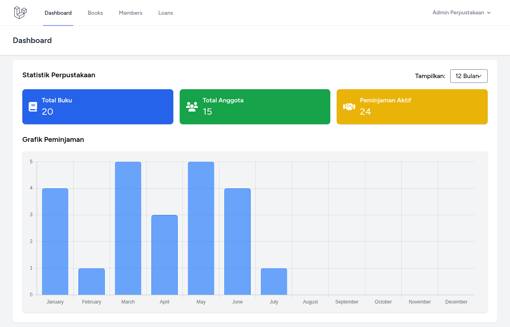
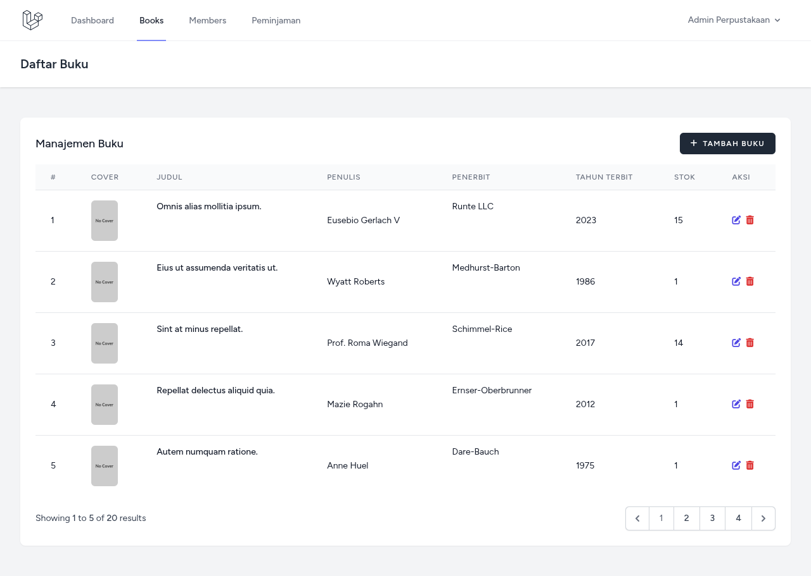
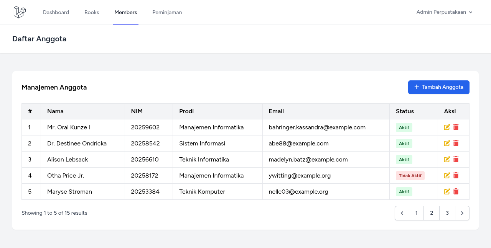
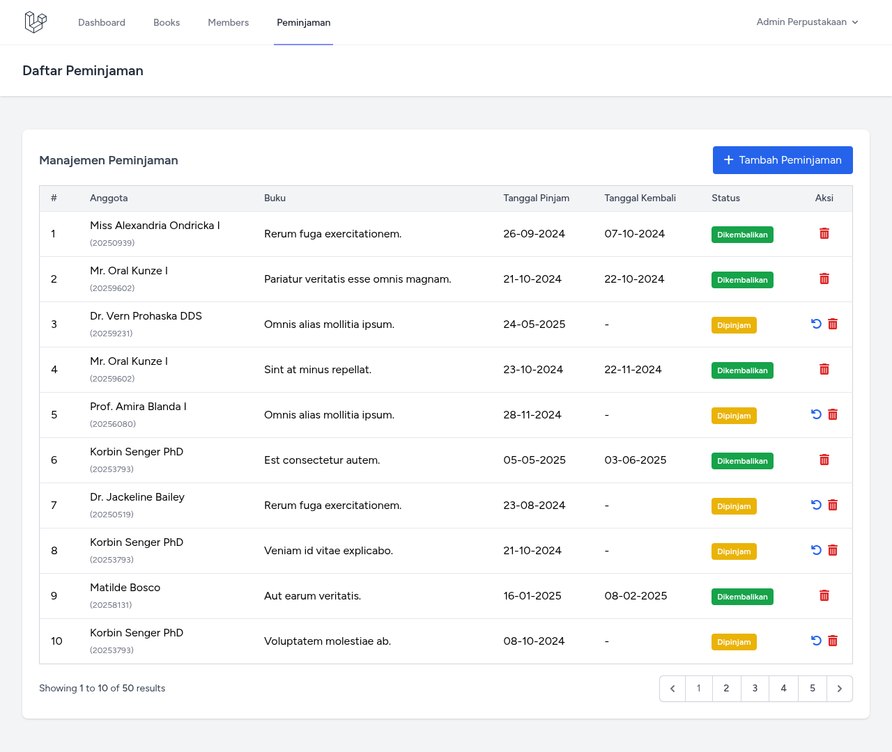

# 📚 Perpustakaan Digital Laravel

Aplikasi **Perpustakaan Digital** berbasis **Laravel** yang memungkinkan admin mengelola data buku, peminjaman, dan anggota perpustakaan. Terdapat dashboard interaktif menggunakan **Chart.js** untuk memantau statistik peminjaman dan koleksi buku.

---
<table>
  <tr>
    <td align="center">
      <br/>
      <strong>Dashboard</strong>
    </td>
    <td align="center">
      <br/>
      <strong>Daftar Buku</strong>
    </td>
  </tr>
  <tr>
    <td align="center">
      <br/>
      <strong>Daftar Anggota</strong>
    </td>
    <td align="center">
      <br/>
      <strong>Riwayat Peminjaman</strong>
    </td>
  </tr>
</table>

---

## 🚀 Fitur Utama

✅ Manajemen Buku  
✅ Manajemen Anggota (Member)  
✅ Peminjaman & Pengembalian Buku  
✅ Dashboard Statistik (Chart.js)  
✅ Autentikasi Admin  
✅ UI modern dengan Blade + Tailwind CSS  
✅ Ikon keren dari Font Awesome  
✅ Seeder bawaan untuk data awal

---

## 🛠️ Teknologi

| Stack       | Detail                       |
|-------------|------------------------------|
| Framework   | Laravel 12                   |
| Templating  | Blade                        |
| Frontend    | Tailwind CSS, Font Awesome   |
| Charting    | Chart.js                     |
| Database    | MySQL                        |

---

## ⚙️ Instalasi

1. **Clone repository**
   ```bash
   git clone https://github.com/namauser/perpustakaan-digital.git
   cd perpustakaan-digital
````

2. **Install dependency**

   ```bash
   composer install
   npm install && npm run build
   ```

3. **Copy file env**

   ```bash
   cp .env.example .env
   ```

4. **Atur konfigurasi database** di file `.env`

   ```
   DB_DATABASE=perpustakaan
   DB_USERNAME=root
   DB_PASSWORD=
   ```

5. **Generate app key**

   ```bash
   php artisan key:generate
   ```

6. **Migrasi dan seed database**

   ```bash
   php artisan migrate --seed
   ```

7. **Jalankan server**

   ```bash
   php artisan serve
   ```

---

## 🔑 Akun Admin Default (Seeder)

| Email                                       | Password |
| ------------------------------------------- | -------- |
| [admin@perpus.com](mailto:admin@perpus.com) | password |

---

## 📂 Struktur Folder Penting

```
app/
├── Http/Controllers/
│   ├── Admin/
│   ├── BookController.php
│   ├── MemberController.php
│   ├── LoanController.php
resources/
├── views/
│   ├── layouts/
│   ├── dashboard.blade.php
│   ├── books/
│   ├── members/
│   ├── loans/
public/
├── img/img1.png
```

---

## 📊 Dashboard Statistik

Dashboard memuat informasi grafik berikut:

* Jumlah buku per kategori
* Jumlah peminjaman per bulan (12 bulan terakhir)
* Jumlah anggota aktif

Menggunakan: **Chart.js** (dengan data dari Laravel Controller)

---

## 🧪 Fitur Seed Otomatis

Saat `php artisan migrate --seed` dijalankan:

* Data dummy untuk buku, anggota, dan transaksi peminjaman otomatis dimasukkan
* Admin default akan dibuat (lihat akun di atas)

---

## 🙌 Kontribusi

Pull request, bug report, atau ide baru sangat diterima!
Silakan fork repository ini dan kirim PR.

---

## 📝 Lisensi

Proyek ini menggunakan lisensi **MIT** – silakan gunakan secara bebas untuk pembelajaran, modifikasi, atau pengembangan lebih lanjut.

---

> Dibuat dengan ❤️ oleh ZU - \[LinkedIn kamu di sini]

```

---

Kalau kamu juga mau README ini dalam versi yang auto-generated pakai script markdown CLI atau menambahkan badge GitHub (build status, license, dsb), tinggal bilang aja ya!
```
